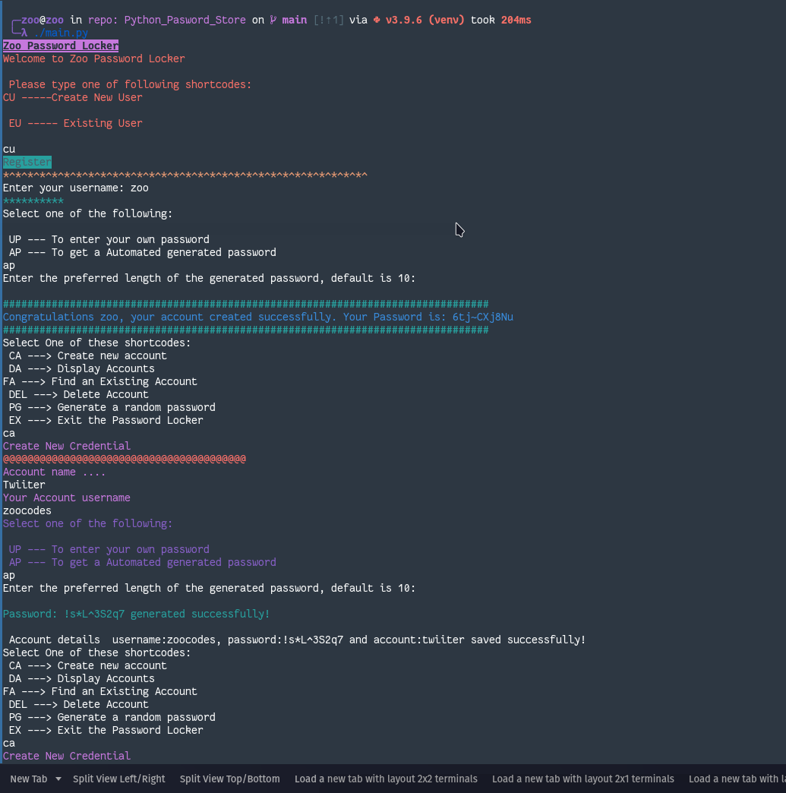

# Python_Password_Store
a password locker cli program to store account details, a login username and password. also, a password generator.

## Author

[Ken Mwaura](https://github.com/KenMwaura1)

## Brief Description

This project is a python application that manages login and signup credentials of a person for various accounts i.e. username and passwords for each account. It also stores the passwords and generates a unique password for a user if they do not want to generate new passwords by themselves.

## User Requirements
The user would like to.... :
* To create an account for the application or log into the application.
* Store my existing accounts' login details for various accounts that i have registered for.
* Generate new password for an account that i haven't registered for and store it with the account name.
* Delete stored account login details that i do now want anymore.
* Copy my credentials to the clipboard.

## Setup instructions
#### The application requires the following installations to get up and running:
* python3 (I'm using python 3.9.6)
* [pyperclip](https://pypi.org/project/pyperclip/)
* pip3
* [Typer](https://typer.tiangolo.com/)
* git
### Installation from git 
* Open your terminal
* `git clone https://github.com/KenMwaura1/Python_Pasword_Store.git`
* `cd Python_Pasword_Store`
* Create a virtual environment. e.g. `python3 -m venv .`
* Activate virtual environment `source venv/bin/activate`
* `pip install -r requirements.txt`
### Running the script
* `chmod +x main.py`
* `./main.py`

### To execute tests 
* `python3 credentials_class_test.py`
* `python3 user_class_test.py`

## Showcase

## Known Errors
pressing enter on default_password_length breaks the app. 

## Technologies Used 
* Python3 
* Git

## Contact Information

If you have any question or contributions, please reach me via [email](kemwaura@gmail.com) or
[Twitter](https://twitter.com/Ken_Mwaura1).

## License

MIT License

Copyright (c) 2021 Ken Mwaura

